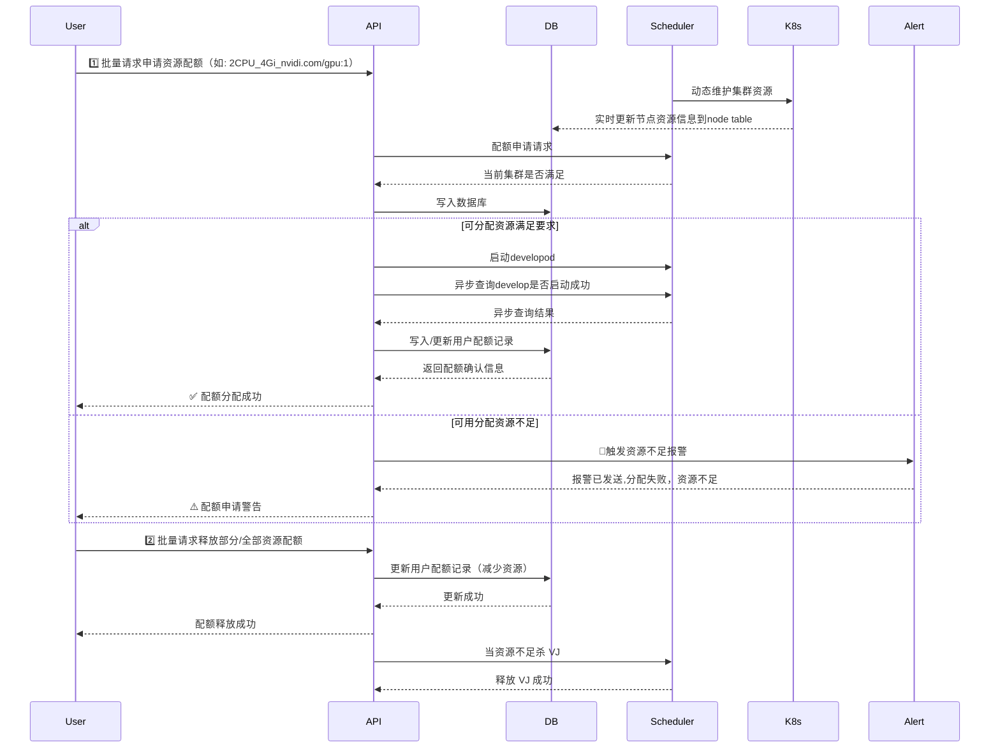

```bash
docker buildx build --platform linux/amd64 \
  -f container/Dockerfile.gnu \
  -t modco/opsflow:2025.0313.1034 \
  --push \
  .

# Before run
deepseek_r1_pvc_model.yaml
deepseek_r1_cm_runcode.yaml

# After run
deepseek_r1_svc.yaml


# GRPC
protoc \
  --proto_path=/usr/include \
  --proto_path=./pkg/apis/proto \
  --go-grpc_out=./pkg/apis/proto \
  --go_out=./pkg/apis/proto \
  --go-grpc_opt=paths=source_relative \
  pkg/apis/proto/cluster_node.proto

protoc \
  --proto_path=/usr/include \
  --proto_path=./pkg/apis/proto \
  --go-grpc_out=./pkg/apis/proto \
  --go_out=./pkg/apis/proto \
  --go-grpc_opt=paths=source_relative \
  pkg/apis/proto/agent.proto


```



现在我有一个主程序可以在公网，一个 agent 不暴露到公网，现在 agent 需要接收主程序的命令执行任务并返回任务状态，以及主程序需要知道连接了哪些 agnet。我想使用 grpc 来实现通信,帮我设计下,使用 go
