```mermaid
sequenceDiagram
    participant User
    participant API
    participant DB
    participant Scheduler
    participant K8s
    participant Alert

    User->>API: 1️⃣ 批量请求申请资源配额（如: 2CPU_4Gi_nvidi.com/gpu:1）
    Scheduler->>K8s: 动态维护集群资源
    K8s-->>DB: 实时更新节点资源信息到node table
    API->>Scheduler: 配额申请请求
    Scheduler-->> API: 当前集群是否满足
    API->>DB: 写入数据库


    alt 可分配资源满足要求
        API->>Scheduler: 启动developod
        API->>Scheduler: 异步查询develop是否启动成功
        Scheduler-->>API: 异步查询结果
        API->>DB: 写入/更新用户配额记录
        DB-->>API: 返回配额确认信息
        API-->>User: ✅ 配额分配成功
    else 可用分配资源不足
        API->>Alert: 🚨触发资源不足报警
        Alert-->>API: 报警已发送,分配失败，资源不足
        API-->>User: ⚠️ 配额申请警告
    end

    User->>API: 2️⃣ 批量请求释放部分/全部资源配额
    API->>DB: 更新用户配额记录（减少资源）
    DB-->>API: 更新成功
    API-->>User: 配额释放成功
    API->>Scheduler: 当资源不足杀 VJ
    Scheduler-->>API: 释放 VJ 成功

```

```bash
docker buildx build --platform linux/amd64 \
  -f container/Dockerfile.gnu \
  -t modco/opsflow:2025.0313.1034 \
  --push \
  .

# Before run
deepseek_r1_pvc_model.yaml
deepseek_r1_cm_runcode.yaml

# After run
deepseek_r1_svc.yaml


# GRPC
protoc \
  --proto_path=/usr/include \
  --proto_path=./pkg/apis/proto \
  --go-grpc_out=./pkg/apis/proto \
  --go_out=./pkg/apis/proto \
  --go-grpc_opt=paths=source_relative \
  pkg/apis/proto/cluster_node.proto

protoc \
  --proto_path=/usr/include \
  --proto_path=./pkg/apis/proto \
  --go-grpc_out=./pkg/apis/proto \
  --go_out=./pkg/apis/proto \
  --go-grpc_opt=paths=source_relative \
  pkg/apis/proto/agent.proto


```




```bash
curl -X POST http://localhost:8090/api/v1/services \
  -H "Content-Type: application/json" \
  -d '{
    "apiVersion": "v1",
    "kind": "Service",
    "metadata": {
      "name": "nginx-service",
      "namespace": "default",
      "labels": {
        "app": "nginx"
      }
    },
    "spec": {
      "selector": {
        "app": "nginx"
      },
      "ports": [{
        "protocol": "TCP",
        "port": 80,
        "targetPort": 80
      }],
      "type": "ClusterIP"
    }
  }'

curl -X DELETE "http://localhost:8090/api/v1/services/default/nginx-service"
curl -X DELETE "http://ubuntu:30968/api/v1/deployments/default/nginx-deployment" 

curl -X GET "http://opsflow-service:8090/api/v1/pod"

curl -X GET "http://ubuntu:30968/api/v1/node?limit=1" | jq .


protoc \
  --proto_path=/usr/include \
  --proto_path=./pkg/api/proto \
  --go-grpc_out=./pkg/api/proto \
  --go_out=./pkg/api/proto \
  --go-grpc_opt=paths=source_relative \
  pkg/api/proto/podexec.proto

protoc \
  --proto_path=/usr/include \
  --proto_path=./pkg/proto \
  --go-grpc_out=./pkg/proto \
  --go_out=./pkg/proto \
  --go-grpc_opt=paths=source_relative \
  pkg/proto/podexec.proto

protoc \
  --proto_path=/usr/include \
  --proto_path=./pkg/proto \
  --go-grpc_out=./pkg/proto \
  --go_out=./pkg/proto \
  --go-grpc_opt=paths=source_relative \
  pkg/proto/podlog.proto
```