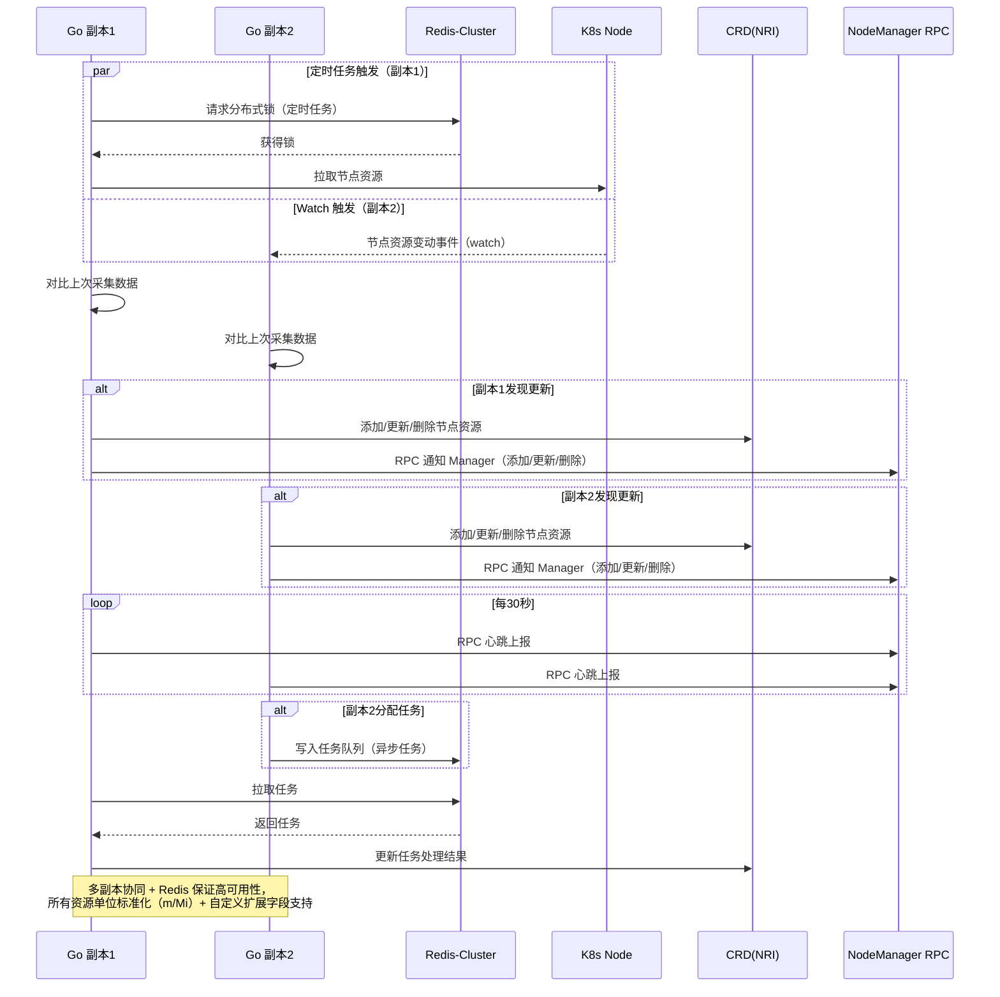

## vllmOnRayAutoJob

通过参数自动构建运行代码中的张量、管道、交换内存与模型路径。

## Realtime node resource info

1. 基本情况：

- go 程序开启多个副本运行
- k8s 集群，多节点
- crd 资源，名称叫 nri。能够存储集群多个节点的基本信息资源信息
- redis-cluster 高可用集群

两个主要逻辑，把节点的资源信息统计添加更新到 crd, 删除已经下线的节点资源 crd。当 crd 资源发生变动的时候调用 rpc 接口去通知 manager, 两个主要逻辑一是根据 watch 实时更新，另外是定时去统计资源信息。

2. 功能实现

- 基于 redis-cluster 高可用集群和多副本程序实现高可用分布式定时任务，部分任务直接在分配到的程序上执行，部分任务添加到队列分布式执行
- 基于 redis-cluster 高可用集群和多副本程序实现监控队列分布式执行任务

分布式定时任务详解：每个定时任务开一个线程，然后放到 redis-cluster 中做个锁，定时任务根据锁执行。为什么使用 crd 存储节点信息，直接使用 node 信息不是更好吗，其实是未来方便对比上一个版本的资源信息和变动后发生了变化需要把变动通知给 manager,另外资源单位的统一比如 cpu 使用 m 内存使用 Mi,还有就是支持各种的自定义资源信息比如 gpu 等。程序会根据 CRD 资源的变化调用多种 rpc 接口，有更新有添加有删除，而且还有定时的心跳。是当 crd 资源发生变动的时候就去触发调用 rpc 接口的逻辑，crd 资源发生变动要么是根据定时要么根据 k8s 的 watch

3. crd 锁

使用乐观锁+重试机制，实现群多个节点的基本信息资源信息 crd 的更新。

